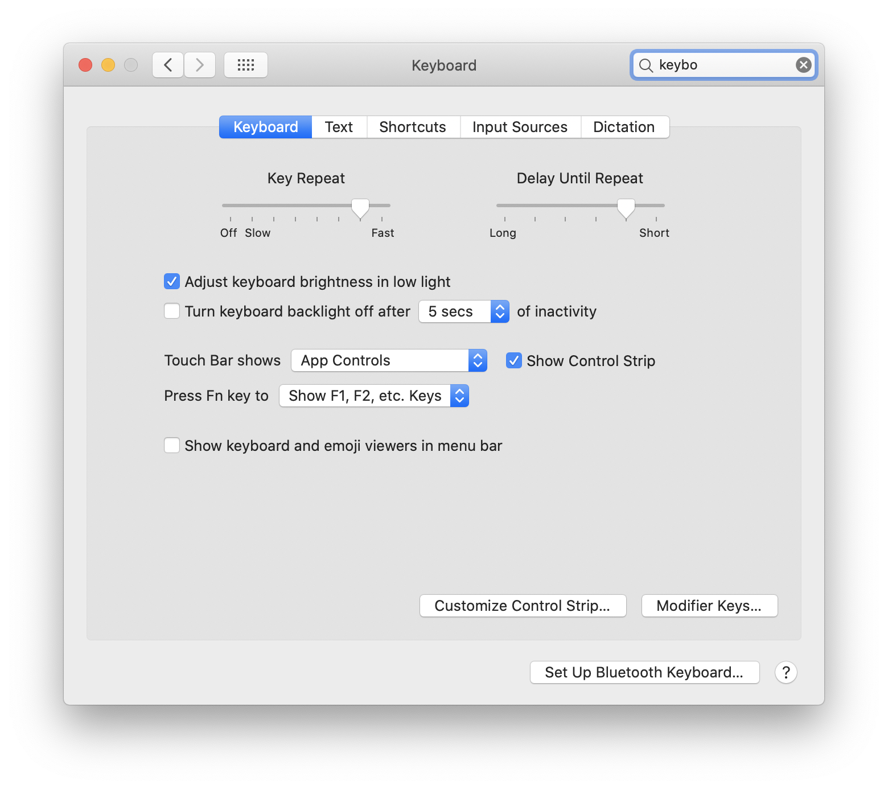

# macOS minimalist Development Setup


[](https://opensource.org/licenses/MIT)

After 20 years of using Windows I migrated to macOS. I started to do some research about how to setup a dev environment mostly for web development: PHP, Javascript & Node. Not super complex, no crazy dev ops, no extensive use of the terminal nor a lot of automation.

I found awesome github repos and tutorials with information, automated install scripts and dozens of tools.
I started with the setup.

> It took me 2 days.

---
## I realized I needed something simpler
I meditate on a daily basis and I practice minimalism. Use and keep only what you need at a certain time.

## I created this guide to setup a macOS Zen Development Environment which can grow and shrink as needed
Goal: This guide is here to help my future self in case I wipe my computer or buy a new one. It is also to help others with a similar approach about setting up a development environment.

Primitives:
- Having a maintainable guide to install a mac development environment in a new or wiped machine without thinking nor searching in Google for solutions
- Being able to install / uninstall anything without globals nor affecting Projects
- Avoiding to install any app that can be used in the browser: slack, spotify, gmail, google drive, etc ***unless***:
- Helping to create sustainable productivity: notion
## Screenshots


## Getting Started
Plug in your new or wiped computer. Follow the installation process. The first thing you should do is update macOS to get the latest security updates and patches. Right now I am on Catalina and did not update to Big Sur yet.
## Command Line Tools
The Command Line Tool package gives Mac terminal users many commonly used tools.
```bash
$ xcode-select --install
```

Command Line Tools are installed at:
```bash
/Library/Developer/CommandLineTools/
```

## oh my zsh


zsh is a replacement for bash.
[Oh My Zsh ](https://ohmyz.sh/#install) is an add on for zsh. It will not make you a 10x developer...but you may feel like one! It will make the terminal more user friendly in a way. I just installed it and used it. No other config needed. It has many plugins and themes which you, my future self can explore.
```bash
sh -c "$(curl -fsSL https://raw.github.com/ohmyzsh/ohmyzsh/master/tools/install.sh)"
```
    For future reference. Example config file in examples/zshrc

## Homebrew


Install Homebrew package manager: it will allow you to install, uninstall and manage packages/apps from the command line.

```bash
$ bin/bash -c "$(curl -fsSL https://raw.githubusercontent.com/Homebrew/install/master/install.sh)"
```

## Tools
I will install git, github cli yarn and make and wget with homebrew.

```bash
$ brew install \
  git \
  gh \
  yarn \
  make \
  wget
```

## zsh autosuggestions
I found this plugin for zsh super useful and intuitive. It suggests commands as you type based on history and completions.
```bash
$ brew install zsh-autosuggestions
$ source /usr/local/share/zsh-autosuggestions/zsh-autosuggestions.zsh
# Reload the terminal or use source ~/.zshrc to apply changes
```
## Apps
Must use apps for my development workflow.


```bash
$ brew install alfred
$ brew install firefox
$ brew install google-chrome
$ brew install rectangle
$ brew install phpstorm
$ brew install local
$ brew install notion
$ brew install postgres
$ brew install postico
$ brew install visual-studio-code
```

- Alfred is kind a replacement for Spotlight
- Firefox for Browsing
- Chrome for Development
- Rectangle for window management using keyboard shortcuts
- Phpstorm for PHP/Wordpress development
- Local by Flywheel for Wordpress development
- Notion
- Postgres
- Postico is a GUI to manage postgres DB
- Visual Studio Code for JAMPP development

## Git & SSH


This config will help to have a global setup for git.
On August 2021, Github will not allow using username/password to login so you will need SSH access.

1. Create a git config file
2. Create a SSH config file
3. Generate SSH key
4. Set it up in github (or another provider)

1. Create a git config file

```
$ touch ~/.gitconfig # Creates the config file
$ open ~/.gitconfig  # Opens the config file
```

Add this to the git config file to set up some shortcuts and defaults.
I have set my email address in github to be private so in the email field it should be set the noreply github email alias. More info [here](https://github.com/dwyl/dev-setup/issues/22)
```text
[alias]
  # Show verbose output about tags, branches or remotes
  tags = tag -l
  branches = branch -a
  remotes = remote -v
  # Pretty log output
  hist = log --graph --pretty=format:'%Cred%h%Creset %s%C(orange)%d%Creset %Cgreen(%cr)%Creset [%an]' --abbrev-commit --date=relative

[color]
  ui = auto
[user]
	name = My Name
	email = email@my.me
[github]
  user   = username
[alias]
  a      = add
  cm     = commit -m
  s      = status
[core]
	excludesfile = /Users/user/.gitignore
[filter "lfs"]
	required = true
	clean = git-lfs clean -- %f
	smudge = git-lfs smudge -- %f
	process = git-lfs filter-process
[pull]
	ff = only
```

2. Create a SSH config file
```bash
$ mkdir ~/.ssh
$ touch ~/.ssh/config # Creates the config file
$ open  ~/.ssh/config  # Opens the config file
```

Add this to the config file. Save and close.
```
 Host *
    AddKeysToAgent yes
    UseKeychain no
    IdentityFile ~/.ssh/id_rsa
```

Generate a SSH key. If you are not sharing the key set the passphrase to none. Leave the key with default name (id_rsa)
```bash
$ ssh-keygen -t rsa -b 4096 -C "email@example.com"
```

Add the SSH key
```bash
$ ssh-add -K ~/.ssh/id_rsa
```

4. I use Github so, future me, follow the github steps to add the SSH key [here](https://docs.github.com/en/github/authenticating-to-github/generating-a-new-ssh-key-and-adding-it-to-the-ssh-agent):

    For future reference. Example config file for git in examples/gitconfig
    For future reference. Example config file for ssh in examples/config

## Node.js
Installing Node globally is a *bad practice*. You should install Node using nvm (Node Version Manager) or another version manager. nvm allows you to easily switch between Node versions, which is essential when you work in different projects.
I will install it using Homebrew.

```
$ brew install nvm
```

Create a directory for NVM

```
$ mkdir ~/.nvm
```

Open zsh config file

```bash
$ open ~/.zshrc
```

Add nvm config
```bash
$ export NVM_DIR=~/.nvm
$ source $(brew --prefix nvm)/nvm.sh
# Reload the terminal to apply changes
```
Echoing $NVM_DIR should now return your NVM directory
```bash
$ echo $NVM_DIR
/Users/username/.nvm
```

Install latest node stable version
```
$ nvm install node
```

Verify node installation

```
$ node -v && npm -v
```

## macOS Settings
Personal preferences on how to set up macOS. It is up to you.
## Folders & Projects
    Versioned projects under ~/Projects folder
    Everything else under ~/Documents folder
## Default Commands
    # Show path bar
    defaults write com.apple.finder ShowPathbar -bool true

    # Show status bar
    defaults write com.apple.finder ShowStatusBar -bool true
### Dock
    Hide dock automatically
### Sharing
    Change computer's name > Use something that cannot be matched to you visually. Never use "Pepitos Macbook" sort of name
### Security
    Security & Privacy > General > Require password immediately after sleep or screen saver begins.


    Security & Privacy > FileVault > Set it to enabled.


    iCloud > I do not use iCloud.
    Users & Groups > Setup a password if you did not setup one during installation.
### System
    Keyboard > Key Repeat > Fast (all the way to the right)
    Keyboard > Delay Until Repeat > Short (all the way to the right)



    Keyboard > Text > Disable "Correct spelling automatically"
    Keyboard > Text > Disable "Capitalize words automatically"
    Keyboard > Text > Disable "Add period with double-space"
    Trackpad > Enable "Tap to click"
## App Settings
### Visual Studio Code
    # Path
    Press CMD + SHIFT + P and click "Install code command in PATH"

    # Preferences
    "editor.tabSize": 2
    "editor.rulers": [80]

    # Extensions
    ESlint
    Gitlens
    Highlight Matching Tag
    Prettier

    # Theme
    Visual Studio Dark Theme


## TO DO
- [x] Upload an initial draft
- [ ] Give each item a why
- [ ] Give each item an alternative
- [ ] Draft a process to review the guide so it does not become obsolete
- [ ] Translate to Spanish

## Author
@dariospace
## Contributing
Found mistakes? Improvements? Caveats? Outdated commands? Let me know with a pull request.
## License
MIT ot Public Domain. Whatever.
